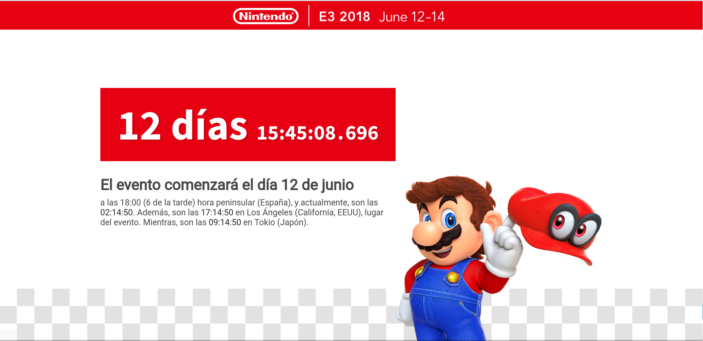

Proyecto para E3 2018. ¡Nos vemos en el 2019!

# Nintendo E3
Cuenta atrás hasta el Nintendo E3 del presente año. Características:

* Cuenta atrás hasta el evento. Se omiten los días si fuese el presente día.
* Zonas horarias relevantes para el evento.
* Música de fondo y vídeos a pantalla completa.
* Tanto los vídeos como la música están sincronizados con la cuenta atrás.
* Voz en off que notifica de forma progresiva el tiempo restante.

Éste es un proyecto personal, utilizado para celebrar el día del E3. El evento elegido es la conferencia de Nintendo, 
por ser esta la conferencia que organizo cada año entre mi círculo de amigos. El proyecto puede ser modificado y 
utilizado libremente para esta u otras conferencias.

La temática de este proyecto puede cambiar según la conferencia que me corresponda organizar en el año, pudiendo 
cambiar al de otra compañía sin previo aviso.
